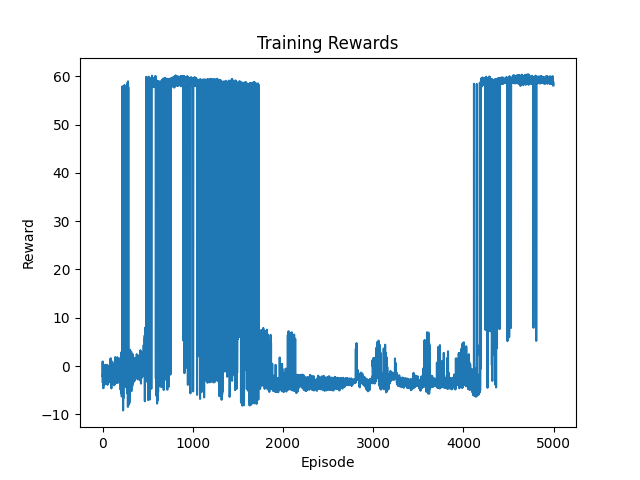
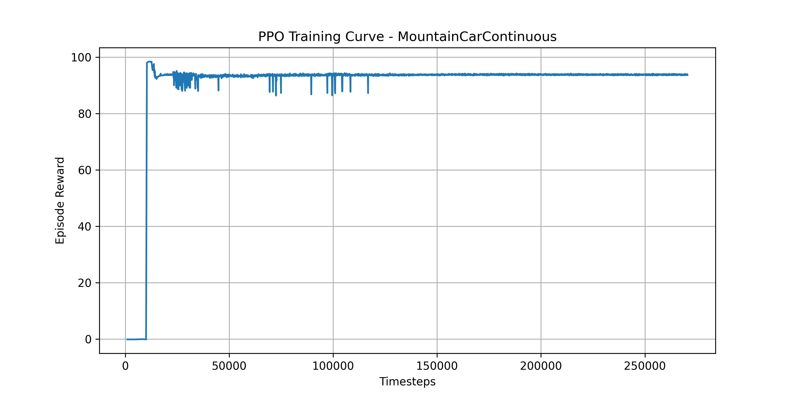
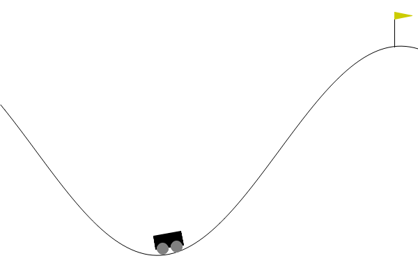
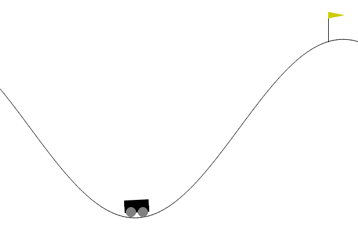

# MountainCar Reinforcement Learning Project

## Project Overview

This project demonstrates the implementation and comparison of two Reinforcement Learning (RL) algorithms on Mountain Car environments using Python, Gymnasium, and Stable-Baselines3.

The project includes:

DQN on MountainCar-v0

PPO on MountainCarContinuous-v0

The purpose of this project is to analyze the performance difference between value-based and policy-based reinforcement learning algorithms.

## Environments 
The agent is a tiny robot car stuck in a valley between two hills.
It has:
2 inputs (position + velocity) 
1 brain: neural network (DQN/PPO) 
3 actions (left, no push, right)

Brain:
where it is (position) 
how fast it is moving (velocity) 
It decides: 
push left,
do nothing,   
push right 

1. MountainCar-v0

Environment Type:

Discrete Action Environment

Possible Actions:

Push Left

No Push

Push Right

Algorithm Used:

DQN (Deep Q-Network)

total episodes = 5000

2. MountainCarContinuous-v0

Environment Type:

Continuous Action Environment

Action Range:

Continuous force between -1 and 1

Algorithm Used:

PPO (Proximal Policy Optimization)

total timesteps = 300000

## Technologies Used

Python (Programming language)
Gymnasium(RL Environment)
Stable-Baselines3 (RL library)
Numpy 
Matplotlib (Graph)
Imageio  (Gifs)
OpenCV (Video)
pytorch 

## Dependencies

Install all required libraries using:

pip install gymnasium
pip install stable-baselines3
pip install numpy
pip install matplotlib
pip install imageio
pip install imageio-ffmpeg
pip install opencv-python
pip install torch

# Step 1 — Move to project folder
cd MOUNTAIN_CAR/Continuous(Mountain_Car)

# Step 2 — Activate your virtual environment
venv\Scripts\activate       

# Step 3 — Install dependencies
pip install gymnasium  
pip install stable-baselines3  
pip install numpy  
pip install matplotlib    
pip install imageio    
pip install imageio-ffmpeg   
pip install opencv-python   
pip install torch   

# Step 4 — Train the agent
python train.py

# Step 5 — Test the agent
python test.py

# Step 6 — Generate GIFs
python gifs.py

# Step 7 — Record video
python record_video.py

# Step 8 — Plot training results
python plot_results.py

same for both just a file name difference.

## Comparison

### MountainCar-V0 (DQN):
The car can only push left , do nothing, push right.
harder to fine-control motion.
It explore hardly (randomly), but fast.
It depends heavily on reward shaping.
Training Complexity: 5000 episodes, replay buffer, epsilon decay.

### MountainCarContinuous-V0 (PPO):
The car can apply weak or strong force left/right, movement is smooth, easier to build momentum once learned.
It explores smoothly, slower but stable, and smooth momentum control.
Training Complexity: 300000 Timesteps, no replay buffer, stable updates, normalization used.

DQN is a powerful algorithm but struggles with instability on MountainCar due to its discrete nature and tendency for catastrophic forgetting. PPO, being a policy-based method designed for continuous control, converges faster, learns more stably, and generalizes better, making it the better for this environment.

## Graphs

### DQN

### PPO

## Videos

### DQN

### PPO

## Projet by:
#### Malaika Babar
